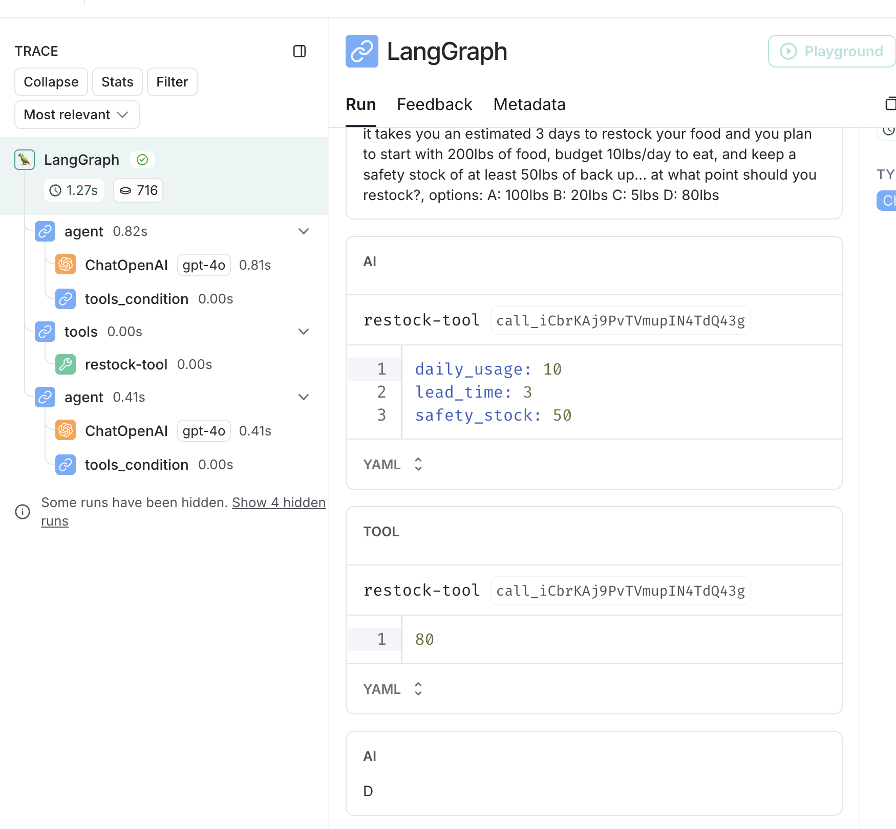

# Welcome to the Oregon Trail

In this workshop we are going to create an AI agent that can help us solve the challenges necessary to survive the journey.

The oregon trail is cute and all but why are we doing this??

When building production chatbot systems there are many sorts of edge cases and types of ways that a user might interact with a system in an analgous fashion the Oregon Trail game presents us with different situations and edge cases to work though.

This workshop will get us on our way creating an graph based agentic workflow that can process these different scenarios and implement the necessary tools and react appropriately.

# Pre-requisites

- python >= 3.11
- docker
- openai secret key

## Define env file

Run the following to create a .env file
`cp dot.env .env`

Update the contents of that file with the relevant values:
```bash
REDIS_URL="redis://localhost:6379/0"
OPENAI_API_KEY=your_openai_secret_keys
```

## (Optional) Using LangSmith to make debugging easier

You can make a free account with LangSmith to get access to an interface that looks like this:


When you create your account you'll get access to the following env variables and you can set them here in this project in your `.env`

```bash
LANGCHAIN_TRACING_V2=
LANGCHAIN_ENDPOINT=
LANGCHAIN_API_KEY=
LANGCHAIN_PROJECT=
```

## Installing packages

Assuming you have a stable install of python going let's setup a virtual env and install the project requirements.

Create a virtual environment:
`python -m venv venv`

Activate the environment:

Mac/linux:
`source venv/bin/activate`

Windows:
`venv\Scripts\activate`

Install the requirements:
`pip install -r requirements.txt`

## Running Redis

With docker (recommended):
`docker run -d --name redis -p 6379:6379 -p 8001:8001 redis/redis-stack:latest`

## Test setup

To make sure redis is connecting properly and your LLM is authenticated run the following script:

`python test_setup.py`

# The hardest part is over - let's code!

## Getting started

You will be adding code to the `participant.py` file. The edits you make in this file will be read into the test suit and your objective will be to add the code necessary to pass all the tests.

## 1. Defining a graph and adding the first tool to the chain

## 2. Adding a semantic caching layer

## 3. Adding a routing layer

## 4. Defining a custom tool

