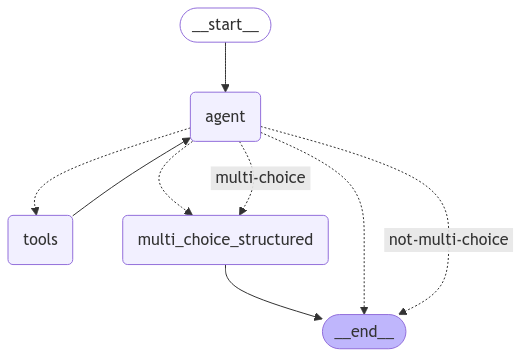

# Welcome to the Oregon Trail

In this workshop we are going to use [LangGraph](https://langchain-ai.github.io/langgraph/) to create a tool calling LLM agent that can survive a set of Oregon Trail themed scenarios. Additionally, we will setup and configure a semantic cache, allow/block list router, and a vector retrieval tool. The final architecture will look like this:

# Diagram in Excalidraw but currently can't access

# Pre-requisites

- [python >= 3.11](https://www.python.org/downloads/)
- [docker](https://docs.docker.com/get-started/get-docker/)
- [openai api key](https://platform.openai.com/docs/quickstart)

## (Optional) helpers

- [LangSmith](https://docs.smith.langchain.com/)
- [LangGraph Studio](https://studio.langchain.com/)
- [Jupyter notebooks for vscode](https://marketplace.visualstudio.com/items?itemName=ms-toolsai.jupyter-renderers)

# Environment setup

### 1. copy and update env file

Run the following to create a .env file
`cp dot.env .env`

Update the contents of that file with your [openai api key](https://platform.openai.com/docs/quickstart) and optional LangSmith credentials:
```bash
REDIS_URL="redis://localhost:6379/0"
OPENAI_API_KEY=openai_key

# Update if using LangSmith otherwise keep blank
LANGCHAIN_TRACING_V2=
LANGCHAIN_ENDPOINT=
LANGCHAIN_API_KEY=
LANGCHAIN_PROJECT=
```

### 2. setup python environment

Assuming you have a stable install of python going let's setup a virtual env and install the project requirements.

Make sure you're in your project fork:
`cd <your-project-fork>`

Create a virtual environment:
`python -m venv venv`

Activate the environment:

Mac/linux:
`source venv/bin/activate`

Windows:
`venv\Scripts\activate`

Install the requirements:
`pip install -r requirements.txt`

### 3. Running a local Redis instance

With docker (recommended):
`docker run -d --name redis -p 6379:6379 -p 8001:8001 redis/redis-stack:latest`

Navigate to `http://localhost:8001/` on your machine and inspect the database with the redis insight GUI.

### 4. Test setup

To make sure redis is connecting properly and your LLM is authenticated run the following script:

`python test_setup.py`

If you get a message that states `You're ready to go!` you are, in fact, ready.

# The hardest part is over - let's code!

## Review project structure

- The questions your agent will be tested on are all within the `question.json` file.
- You will perform all your work in the `/participant_agent` folder.
- Within this folder there are various **TODO** tasks for you to complete in the corresponding files.

## Complete required boilerplate

- open [participant_agent/utils/nodes.py](participant_agent/utils/nodes.py)
    - define a system prompt
    - pass that variable as the content within that message dict
    - pass the model name to the _get_tool_model function this function binds tools to a specified model
    - pass the messages to be invoked by the model
- open [participant_agent/graph.py](participant_agent/graph.py)
    - node 1 should have label `agent` and invoke the `call_tool_model` we just defined
    - node 2 should have label `tools` and invoke the `tool_node`. The tool node utilizes a built in wrapper from LangChain and makes all tools defined in the tools file available to the LLM agent.
    - `add_conditional_edge` takes the starting point, `“agent”`, and a function for determining the next tool to call. For simplicity we will use the built in `tools_condition` imported for you.
    - Define an edge such that flow can go from “tools” back to the “agent” aka the normal edge.
- open [participant_agent/utils/tools.py](participant_agent/utils/tools.py)
    - there is nothing you need to modify in this folder but you will see shell implementations for the tools we will be defining in this workshop.
    - notice the multiply example this shows how tools can take input and **require a meaningful doc_string** so the LLM "knows" when to use that particular tool.

You can see a visual of the graph you just created by opening [/sandbox.ipynb](sandbox.ipynb) notebook or by opening your project folder with LangGraph studio.

From the project root run:

`python oregon_trail.py` to see if everything runs.

Note: The expected behavior is you will see some logs and fail on the first question.

## Scenario 1: Name of the Wagon Leader.

**question**: What is the first name of the wagon leader?
**answer**: Artificial

When working with LLM we need to provide them context of "who" they are and what their purposes is to get the best results. Don't underestimate the value of good prompting!

Update the system prompt to something like:

```bash
You are an oregon trail playing tool calling AI agent. Use the tools available to you to answer the question you are presented. When in doubt use the tools to help you find the answer.
If anyone asks your first name is Artificial return just that string.
```

Run `python oregon_trail.py` to see if you pass

Now you should get past the first question but fail on the second about restocking.

## Scenario 2: Planning restock

On the trail, you may have to do some planning in regards to how much food you want to utilize and when you will need to restock.

**question**: In order to survive the trail ahead, you'll need to have a restocking strategy for when you need to get more supplies or risk starving. If it takes you an estimated 3 days to restock your food and you plan to start with 200lbs of food, budget 10lbs/day to eat, and keep a safety stock of at least 50lbs of back up... at what point should you restock?
**answer**: D
**options**: [A: 100lbs, B: 20lbs, C: 5lbs, D: 80lbs]

steps:
- update the restock-tool description with a meaningful doc_string that provides context for the LLM
- implement the restock formula: `(daily_usage * lead_time) + safety_stock`
- update the `RestockInput` class such that it receives the correct variables
- pass the restock_tool to the exported `tools` list

Run `python oregon_trail.py` to see if you pass

### Scenario 2 sub-problem: structured output

At this stage, you may notice that your agent is returning a "correct" answer to the question but not in the format the test script expects. Specifically the testing script expects answers to multiple choice questions to be the single character "A", "B", "C", or "D". This may seem contrived, but often in production scenarios agents will be expected to work with existing deterministic systems that will require specific schemas. For this reason, LangChain supports an LLM call `with_structured_output` so that response can come from a predictable structure.

steps:
- open [participant_agent/utils/state.py](participant_agent/utils/state.py) and uncomment the multi_choice_response attribute on the state parameter. To this point our state has only had one attribute called `messages` but we are adding a specific field that we will add structured outputs to.
    - also observe the defined pydantic model in this file for our output
- next open [participant_agent/utils/nodes.py](participant_agent/utils/nodes.py) and complete the TODOs
    - pass the pydantic class to the `with_structured_output` function
    - return the response from the multi_choice_structured `{"multi_choice_response": response.multiple_choice_response}`
    - we will come back and update the `is_multi_choice` function in a second
- update our graph to support a more advanced flow (see image below)
    - add a node for our `multi_choice_structured` this takes the messages after our tool calls and uses an LLM to format as we expect.
    - add a conditional edge after the agent that determines if a multi-choice formatting is appropriate (see example)
    - update the `is_multi_choice` function in the nodes file to return the appropriate strings
    - add an edge that goes from `multi_choice_structured` to `END`

Conditional edge example:

```python
workflow.add_conditional_edges(
    "agent",
    is_multi_choice, # function in nodes that returns a string ["multi-choice", "not-multi-choice"]
    {"multi-choice": "multi_choice_structured", "not-multi-choice": END}, # based on the string returned from the function instructs graph to route to a given node
)
```

Final graph should look like this:


Run `python oregon_trail.py` to see if you pass

### Comments

After these changes our graph is more predictable with structure output however it's important to note that a tradeoff has been incurred. Our results will be more deterministic but we had to add an additional LLM call and additional complexity to our graph in order to accomplish this feat. It's not necessarily a bad thing but it's important to keep in mind as LLM bills and latency can scale quickly.


## Scenario 3: Retrieval information

On the trail, you might need to ask for help to get specific contextual information necessary to answer certain types of questions.

**question**: You’ve encountered a dense forest near the Blue Mountains, and your party is unsure how to proceed. There is a fork in the road, and you must choose a path. Which way will you go?
**answer**: B
**options**: [A: take the northern trail, B: take the southern trail, C: turn around, D: go fishing]

steps:
- open [participant_agent/utils/vector_store.py](participant_agent/utils/vector_store.py)
- a function has been started for you that first checks if a vector index already exists and if not creates it. You will implement the part when it needs to be created.
- to do this we will leverage the `.from_documents` function within the `langchain_redis.RedisVectorStore` class. Ex: `RedisVectorStore.from_documents(<docs>, <embedding_model>, config=<config>)` where the doc is the pre-defined info that the northern trail was flooded.
- open the tools file and update the create_retriever_tool to take the correct params. Ex: `create_retriever_tool(vector_store.as_retriever(), "get_directions", "meaningful doc string")`
- make sure the retriever tool is included in the list of tools

Run `python oregon_trail.py` to see if you pass

If this passes open `localhost:8001` and see your vector record stored within the database.


## Scenario 4: Speed example

On the trail, sometimes speed is more important than holistic logic. For these type of question you might want to bypass the agent layer all together if you have already cached what a system should respond with given a certain situation.

**question**: There's a deer. You're hungry. You know what you have to do...
**answer**: bang

steps:
- open [participant_agent/utils/semantic_cache.py](participant_agent/utils/semantic_cache.py)
- set semantic_cache to be an instance of the `redisvl.extensions.llmcache.SemanticCahe` class. Ex: `SemanticCache(name=, redis_url=, distance_threshold=0.1)`
- store a prompt similar to the question and answer pair shown above (a similar example is provided in the file). Ex: `semantic_cache.store(prompt=, response=)`

Run `python oregon_trail.py` to see if you pass

If this passes open `localhost:8001` and see the cached record stored within the database.


## Scenario 5: Allow/block list with Router

On the trail, you may run into situations where your agent is simply being asked the wrong questions and you don't want to waste expensive resources dealing with unnecessary topics. In this case we will add a routing layer in front of our agent to prevent our Oregon Trail bot from answering unrelated questions.

**question**: Tell me about the S&P 500?
**answer**: you shall not pass

steps:
- open [workshop/participant_agent/utils/router.py](workshop/participant_agent/utils/router.py)
- define the `blocked_route`. This will be the route that inputs similar to the blocked_references will be routed to. Ex: `Route(name=, references=)`
- define the router using the `SemanticRouter` from redisvl. Ex: `SemanticRouter(name=, vectorizer= routes=[], redis_url=REDIS_URL, overwrite=True)`

Run `python oregon_trail.py` to see if you pass

If this passes open `localhost:8001` and see the route records stored within the database.


# You survived the Oregon Trail!!

## Let's review

- You created a tool calling AI Agent
- You defined a custom tool for mathematical operations (restocking)
- You added structured output for when a system requires answers within a certain form.
- You defined a tool that implements Retrieval Augmented Generation aka RAG (retrieval tool)
- You created a semantic cache that can increase the speed and cost effectiveness of your agent workflow by short circuiting for known inputs/outputs.
- You implemented a router to protect your system from wasting time/resources on unrelated topics.
