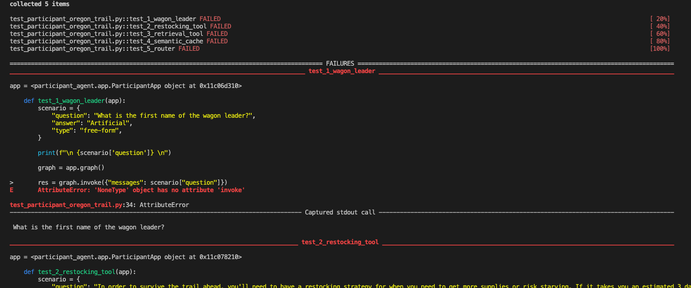
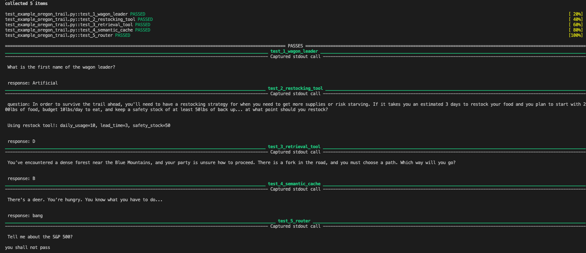
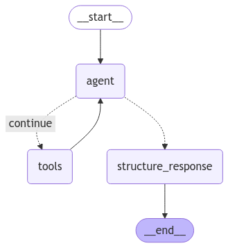
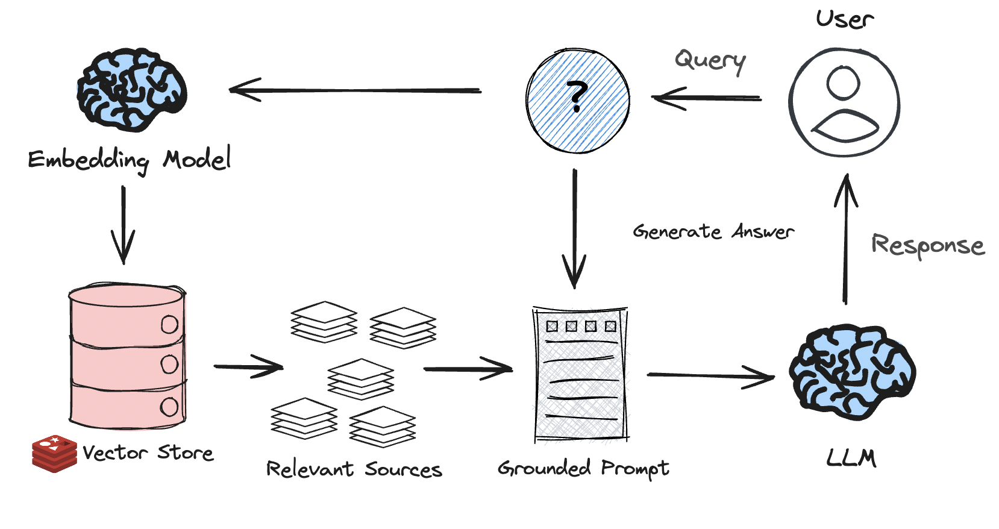
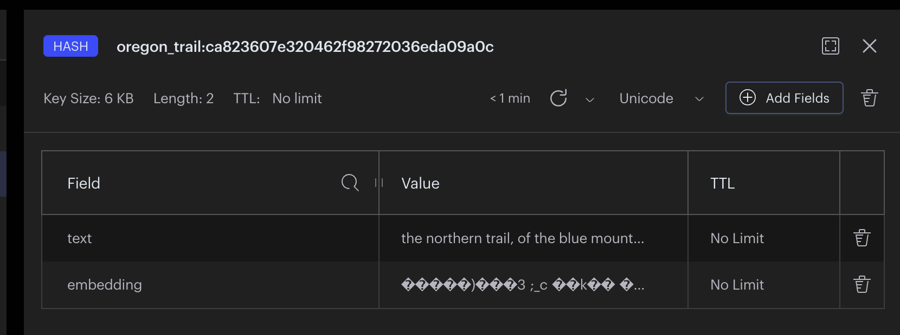
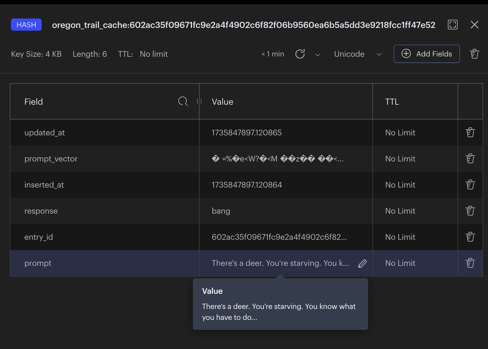
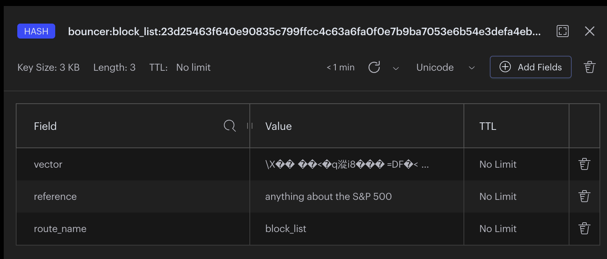
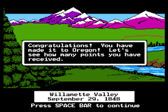

<div>
<div> </div>
</div>
<br>

# Oregon Trail Agent Workshop

In this workshop, we are going to use [LangGraph](https://langchain-ai.github.io/langgraph/) to create a tool calling LLM agent that can survive a set of Oregon Trail themed scenarios. Additionally, we will setup and configure a semantic cache, allow/block list router, and a vector retrieval tool. The final architecture will look like this:


# Pre-requisites

- [python == 3.12.8](https://www.python.org/downloads/release/python-3128/)
    - **Note:** this workshop was tested with version 3.12.8.
    - You may experience issues if using another version!
- [docker](https://docs.docker.com/get-started/get-docker/)
- [openai api key](https://platform.openai.com/docs/quickstart)

## (Optional) Ollama
This workshop is optimized to run targeting OpenAI models. If you prefer to run locally however, you may do so via Ollama. 
* [Ollama setup instructions](Ollama.md)

## (Optional) helpers

- [LangSmith](https://docs.smith.langchain.com/)
- [LangGraph Studio](https://studio.langchain.com/)
- [Jupyter notebooks for vscode](https://marketplace.visualstudio.com/items?itemName=ms-toolsai.jupyter-renderers)

# Environment setup

## Copy and update env file

Run the following to create a .env file
`cp dot.env .env`

Update the contents of that file with your [openai api key](https://platform.openai.com/docs/quickstart) and optional LangSmith credentials:
```bash
REDIS_URL="redis://localhost:6379/0"
OPENAI_API_KEY=openai_key

# Update if using LangSmith otherwise keep blank
LANGCHAIN_TRACING_V2=
LANGCHAIN_ENDPOINT=
LANGCHAIN_API_KEY=
LANGCHAIN_PROJECT=
```

## Setup python environment

[Download python](https://www.python.org/downloads/release/python-3128/): version **3.12.8** is recommend.

#### cd into project folder:
`cd oregon-trail-agent-workshop`

#### Check python version:
`python --version`

#### Create a virtual environment:
`python -m venv venv`

#### Activate the environment:

Mac/linux:
`source venv/bin/activate`

Windows:
`venv\Scripts\activate`

#### Install the requirements:
`pip install -r requirements.txt`

## Run Redis instance

### With docker:
`docker run -d --name redis -p 6379:6379 -p 8001:8001 redis/redis-stack:latest`

Navigate to `http://localhost:8001/` on your machine and inspect the database with the redis insight GUI.

## Test setup

To make sure your environment is properly configured run:

`python test_setup.py`

If you don't get any errors you are ready to go! If you do get errors **ask for help!** The rest of the workshop will not work if this doesn't.

# Workshop objective

The objective of this workshop is to build an agentic app that can handle 5 different scenarios essential to surviving the Oregon Trail (and potentially apps you build in the future).

The scenarios:
1. Knowing the name of the wagon leader (basic prompting).
2. Knowing when to restock food (implementing a custom tool).
3. Knowing how to ask for directions (retrieval augmented generation).
4. Knowing how to hunt (semantic caching).
5. Knowing what to ignore (allow/block list router).

Note: you can see the details of each scenario question/answer in [questions.json](questions.json).

## Testing progress

To test progress along the trail save the following alias in a pretty format use:

```bash
pytest --disable-warnings -vv -rP test_participant_oregon_trail.py
```


If you're on mac/linux you can save this as an alias so you don't have to keep the whole thing.
```bash
alias test_trail_agent="pytest --disable-warnings -vv -rP test_participant_oregon_trail.py"
```

Then run `test_trail_agent` to invoke the workshop tests.

### Note: these test **will fail** at first - that's okay - you will be fixing them!

Where you'll start:


Where you'll end:


# Project structure and flow

- You will perform **all** your work in the [/particpant_agent](/participant_agent/) folder.
- Within this folder there are various **TODO** tasks for you to complete in the corresponding files.
- After making updates you will test if the next test passes by running `test_trail_agent`


# Scenario 1: name of the wagon leader.

**Question**: What is the first name of the wagon leader? <br>
**Answer**: "Art" (short for Artificial Intelligence)

## Steps to complete:

### update the system prompt

Open [participant_agent/utils/nodes.py](./participant_agent/utils/nodes.py)

Find the variable system_prompt and set to:

`You are an oregon trail playing tool calling AI agent. Use the tools available to you to answer the question you are presented. When in doubt use the tools to help you find the answer. If anyone asks your first name is Art return just that string.`

When working with LLMs, we need to provide a useful context to the model. In this case, we are telling the model what it's meant to do (play the Oregon Trail) and that it's name is "Art". This may seem trivial but don't underestimate the value of good prompting!

### Define a graph

Open [participant_agent/graph.py](./participant_agent/graph.py)

### Note: instructor will be going through this in detail if you get confused.

> To see an example of creating a graph and adding a node, see the [LangGraph docs](https://langchain-ai.github.io/langgraph/tutorials/introduction/#part-1-build-a-basic-chatbot)

- Uncomment boilerplate (below the first TODO)
- Delete `graph = None` at the bottom of the file - this is just a placeholder.
- Define node 1, the agent, by passing a label `"agent"` and the code to execute at that node `call_tool_model`
- Define node 2, the tool node, by passing the label `"tools"` and the code to be executed at that node `tool_node`
- Set the entrypoint for your graph at `"agent"`
- Add a **conditional edge** with label `"agent"` and function `tools_condition`
- Add a normal edge between `"tools"` and `"agent"`

Run `test_trail_agent` if you saved the alias or `pytest --disable-warnings -vv -rP test_participant_oregon_trail.py` to see if you pass the first scenario.

If you didn't pass the first test **ask for help!**.

To see a visual of your graph checkout [sandbox.ipynb](./sandbox.ipynb).

## Scenario 2: restocking tool

On the trail, you may have to do some planning in regards to how much food you want to utilize and when you will need to restock.

**Question**: In order to survive the trail ahead, you'll need to have a restocking strategy for when you need to get more supplies or risk starving. If it takes you an estimated 3 days to restock your food and you plan to start with 200lbs of food, budget 10lbs/day to eat, and keep a safety stock of at least 50lbs of back up... at what point should you restock? <br>
**Answer**: D <br>
**Options**: [A: 100lbs, B: 20lbs, C: 5lbs, D: 80lbs] <br>

### Steps:
> For an example on creating a tool, see the [LangChain docs](https://python.langchain.com/docs/how_to/custom_tools/)

> If you've not used types with Python before, [see the Pydantic docs](https://docs.pydantic.dev/latest/concepts/fields/)
- Open [participant_agent/utils/tools.py](./participant_agent/utils/tools.py) update the restock-tool description with a meaningful doc_string that provides context for the LLM.
Ex: `restock formula tool used specifically for calculating the amount of food at which you should start restocking.`
- Implement the restock formula: `(daily_usage * lead_time) + safety_stock`
- Update the `RestockInput` class such that it receives the correct variables
- Pass the restock_tool to the exported `tools` list

### Scenario 2 sub-problem: structured output

At this stage, you may notice that your agent is returning a "correct" answer to the question but not in the **format** the test script expects. The test script expects answers to multiple choice questions to be the single character "A", "B", "C", or "D". This may seem contrived, but often in production scenarios agents will be expected to work with existing deterministic systems that will require specific schemas. For this reason, LangChain supports an LLM call `with_structured_output` so that response can come from a predictable structure.

### Steps:
- Open [participant_agent/utils/state.py](participant_agent/utils/state.py) and uncomment the multi_choice_response attribute on the state parameter and delete the pass statement. Up to this point our state had only one attribute called `messages` but we are adding a specific field for our structured multi-choice response.
    - Also observe the defined `pydantic` model in this file for our output
- Open [participant_agent/utils/nodes.py](participant_agent/utils/nodes.py) and pass the pydantic class defined in state to the `with_structured_output` function.
- Update the graph to support a more advanced flow (see image below)
    - Add a node called `structure_response` and pass it the `structure_response` function.
        - This function determines if the question is multiple choice. If yes, it use the with_structured_output model you updated. If no, it returns directly to end.
    - Add a conditional edge utilizing the `should_continue` function defined for you in the file (See example below).
    - Finally, add an edge that goes from `structure_response` to `END`

### Conditional edge example:

```python
workflow.add_conditional_edges(
    "agent",
    should_continue,
    {"continue": "tools", "structure_response": "structure_response"},
)
```

### Visual of your updated graph:

<br>

Run `test_trail_agent` to see if you pass

### Comments

After these changes our graph is more predictable with structure output however it's important to note that a tradeoff has been incurred. Our results will be more deterministic but we had to add an additional LLM call and additional complexity to our graph in order to accomplish this feat. It's not necessarily a bad thing but it's important to keep in mind as LLM bills and latency can scale quickly.


## Scenario 3: retrieval tool

**Question**: You’ve encountered a dense forest near the Blue Mountains, and your party is unsure how to proceed. There is a fork in the road, and you must choose a path. Which way will you go? <br>
**Answer**: B <br>
**Options**: [A: take the northern trail, B: take the southern trail, C: turn around, D: go fishing]

This scenario requires us to implement Retrieval Augmented Generation (RAG) within our agent workflow. There are cases when an LLM can't be expected to know some piece of information based on its training data and therefore needs to be supplemented.

This is often the case for **time-bound** or **proprietary** data. In which case you might augment generation from an LLM by pulling helpful data from a vector database.

In our scenario we want to be able to retrieve the time-bound information that the `"the northern trail, of the blue mountains, was destroyed by a flood and is no longer safe to traverse. It is recommended to take the southern trail although it is longer."`. By creating a `retriever_tool` that our agent knows how to use.





### Steps:
- Open [participant_agent/utils/vector_store.py](participant_agent/utils/vector_store.py)
- Find the corresponding `get_vector_store` method either for openai or ollama 
- If using openai: where `vector_store=None` update to `vector_store = RedisVectorStore.from_documents(<docs>, <embedding_model>, config=<config>)` with the appropriate variables.

> For `<embedding model>`, keep in mind whether you are using openai or ollama. If using ollama, the `model` parameter should be set to `nomic-embed-text` \
[OpenAI embeddings](https://python.langchain.com/docs/integrations/text_embedding/openai/) \
[Ollama embeddings](https://python.langchain.com/docs/integrations/text_embedding/ollama/)

- Open [participant_agent/utils/tools.py](participant_agent/utils/tools.py)
    - Uncomment code for retrieval tool
    - Update the create_retriever_tool to take the correct params. Ex: `create_retriever_tool(vector_store.as_retriever(), "get_directions", "meaningful doc string")`
- Make sure the retriever tool is included in the list of tools

Run `test_trail_agent` to see if you pass

If this passes open `localhost:8001` and see your vector record stored within the database.



## Scenario 4: semantic cache


On the trail, sometimes speed is more important than holistic logic. For these type of question you might want to bypass the agent layer all together if you have already cached what a system should respond with given a certain situation.

**Question**: There's a deer. You're hungry. You know what you have to do...
**Answer**: bang

### Steps:
- Open [participant_agent/utils/semantic_cache.py](participant_agent/utils/semantic_cache.py)
- Set semantic_cache to be an instance of the `redisvl.extensions.llmcache.SemanticCahe` class. Ex: `SemanticCache(name=, redis_url=, distance_threshold=0.1)`
- Store a prompt similar to the question and answer pair shown above (a similar example is provided in the file). Ex: `semantic_cache.store(prompt=, response=)`

Run `test_trail_agent` to see if you pass

If this passes open `localhost:8001` and see the cached record stored within the database.



## Scenario 5: allow/block list with router


On the trail, you may run into situations where your agent is simply being asked the wrong questions that you don't want to waste expensive LLM calls dealing with. In this case, we will add a routing layer in front of our agent to prevent our Oregon Trail bot from answering unrelated questions.

**Question**: Tell me about the S&P 500?
**Answer**: you shall not pass

### Steps:
- Open [participant_agent/utils/router.py](participant_agent/utils/router.py)
- Define the `blocked_route`. This will be the route that inputs similar to the blocked_references will be routed to. Ex: `Route(name=, references=)`
- Define the router using the `SemanticRouter` from redisvl. Ex: `SemanticRouter(name=, vectorizer= routes=[], redis_url=REDIS_URL, overwrite=True)`

Run `test_trail_agent` to see if you pass

If this passes open `localhost:8001` and see the route records stored within the database.



# You survived the Oregon Trail!!



## Review

- You created a tool calling AI Agent
- You defined a custom tool for mathematical operations (restocking)
- You added structured output for when a system requires answers within a certain form.
- You defined a tool that implements Retrieval Augmented Generation aka RAG (retrieval tool)
- You created a semantic cache that can increase the speed and cost effectiveness of your agent workflow by short circuiting for known inputs/outputs.
- You implemented a router to protect your system from wasting time/resources on unrelated topics.
